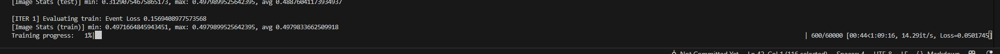
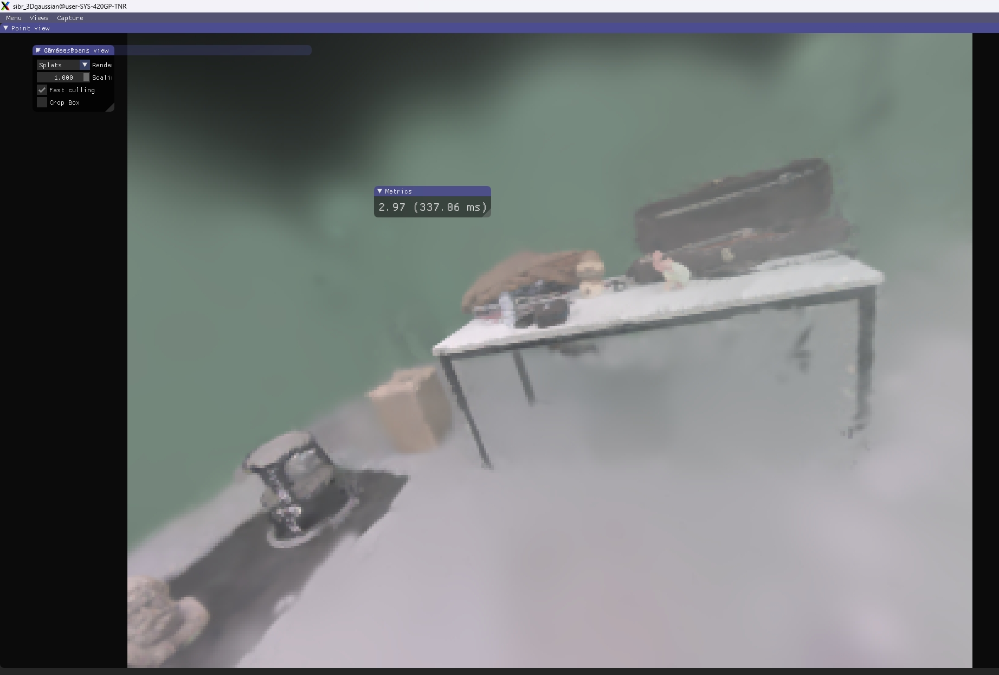
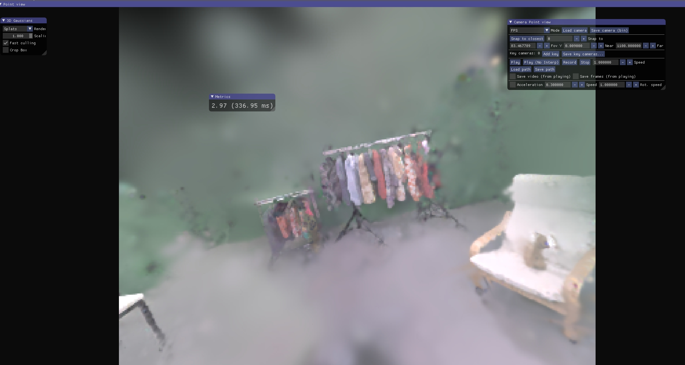
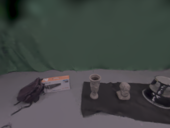
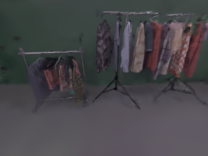
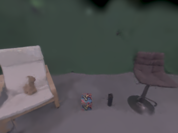
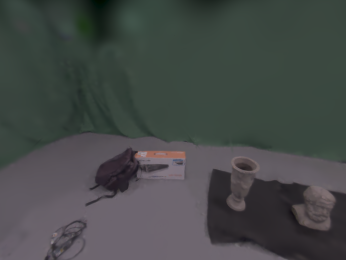

<div align="center">
<h1>测试 （3DV 2025）E-3DGS: Event-based Novel View Rendering of Large-scale Scenes Using 3D Gaussian Splatting</h1>
</div>

## 配置测试

```bash
git clone https://github.com/KwanWaiPang/E-3DGS.git --recursive

# rm -rf .git


conda env create --yes --file environment_cuda12.2.yml #注意A100需要采用这个
#conda env create --yes --file environment_cuda11.6.yml #为cuda11.7采用的版本
conda activate E-3DGS
# conda remove --name E-3DGS --all

conda install pytorch3d -c pytorch3d
pip install submodules/diff-gaussian-rasterization
pip install submodules/simple-knn
# pip install opencv-python pandas piq scipy numba tensorboard matplotlib lpips
pip install pandas piq scipy matplotlib lpips

```

* 下面安装可视化插件

```bash
# Dependencies (注意要su user切换成user)
sudo apt install -y libglew-dev libassimp-dev libboost-all-dev libgtk-3-dev libopencv-dev libglfw3-dev libavdevice-dev libavcodec-dev libeigen3-dev libxxf86vm-dev libembree-dev
# Project setup
cd SIBR_viewers
cmake -Bbuild . -DCMAKE_BUILD_TYPE=Release # add -G Ninja to build faster
cmake --build build -j24 --target install

```

## 训练
首先下载数据集[link](https://drive.google.com/file/d/1AfWS1Pp0Sl_3fRgUuOQ3JLNX86pq3Tn_/view?usp=sharing)
* 下载google drvie数据到服务[link](https://kwanwaipang.github.io/File/Blogs/Poster/ubuntu%E5%91%BD%E4%BB%A4%E8%A1%8C%E4%B8%8B%E8%BD%BD%E6%95%B0%E6%8D%AE.html)

```bash
pip install gdown 
# gdown https://drive.google.com/uc?id=标识符
# conda activate E-3DGS
gdown https://drive.google.com/uc?id=1AfWS1Pp0Sl_3fRgUuOQ3JLNX86pq3Tn_
```

* 然后运行下面命令执行

~~~
python train.py -s /path/to/data/dir/shot_009 -m /path/to/model/output/dir --pose_lr 0.001 --sh_degree 1

python train.py -s /home/gwp/E-3DGS/dataset/shot_009 -m /home/gwp/E-3DGS/output/shot_009 --pose_lr 0.001 --sh_degree 1
~~~

训练要接近一个小时hhh

<div align="center">
  
<figcaption>  
</figcaption>
</div>

* 采用MobaXterm来查看训练效果
~~~
conda activate E-3DGS
cd E-3DGS

./SIBR_viewers/install/bin/SIBR_remoteGaussian_app --path /home/gwp/E-3DGS/output/shot_009 #训练过程查看
./SIBR_viewers/install/bin/SIBR_gaussianViewer_app -m /home/gwp/E-3DGS/output/shot_009 #训练完后查看
~~~

<div align="center">
  
<figcaption>  
</figcaption>
</div>

<div align="center">
  
<figcaption>  
</figcaption>
</div>


* 其他数据的下载链接[E-3DGS-Dataset](https://drive.google.com/drive/folders/1yRlg33ttbhm27EeyCpZTxrWlkX3C5bz1)
~~~
conda activate E-3DGS
gdown https://drive.google.com/uc?id=1K2V0VrIYKDZKNqbQpHEZiBpGaI4Wbh_s
gdown https://drive.google.com/uc?id=1G5o9FY80gcXB7uc5iyVFkRUsv6SfToj6
gdown https://drive.google.com/uc?id=1Grta1sarkejUxskS3I8tPMO_WLRfPgMT
gdown https://drive.google.com/uc?id=1TGYJ_QGr3cuMp0RbdFH33I5AZ6Z30-w0
gdown https://drive.google.com/uc?id=1o92_Dd0ogADas7OCVs5nrFgGOCOKX9zU
gdown https://drive.google.com/uc?id=1sEl361E6_34U4kaRsIue4qjhUlsK0pWI
gdown https://drive.google.com/uc?id=1z34uA6iEmBQfa9hHSNmQlcfrdKqFviZa
gdown https://drive.google.com/uc?id=1P8JykSKwVIxkMr3_v4NIGMjzYrVPJQNW

~~~

## 推理（新视觉合成）

* 注意，此处的`--skip_train`是跳过训练视角，直接只有新视角
```bash
python render.py -s /home/gwp/E-3DGS/dataset/shot_009 -m /home/gwp/E-3DGS/output/shot_009 --skip_train
```

*合成的新视觉（注意，非训练视觉）

<div align="center">
  <table style="border: none; background-color: transparent;">
    <tr align="center">
      <td style="width: 50%; border: none; padding: 0.01; background-color: transparent; vertical-align: middle;">
        
      </td>
      <td style="width: 50%; border: none; padding: 0.01; background-color: transparent; vertical-align: middle;">
        
      </td>
    </tr>
     <tr align="center">
      <td style="width: 50%; border: none; padding: 0.01; background-color: transparent; vertical-align: middle;">
        
      </td>
      <td style="width: 50%; border: none; padding: 0.01; background-color: transparent; vertical-align: middle;">
        
      </td>
    </tr>
  </table>
  <figcaption>
  </figcaption>
</div>
